# Raft 分布式共识算法：原理与工程化实现指南（EasilyNET）

> 目标：形成可直接指导 `EasilyNET` 后续开发的设计文档，覆盖 Raft 原理、架构边界、分阶段落地、测试体系、运维与风险控制。

---

## 1. Raft 算法原理（设计输入）

### 1.1 核心思想

Raft（Replicated And Fault Tolerant）将共识问题拆解为三个相互协作但职责清晰的子问题：

| 子问题          | 职责                        | 关键机制                            |
| --------------- | --------------------------- | ----------------------------------- |
| Leader Election | 选出唯一 Leader             | RequestVote、随机超时、Pre-Vote     |
| Log Replication | Leader 复制日志到 Followers | AppendEntries、一致性检查、回退重试 |
| Safety          | 保证不会产生分叉提交        | 投票限制、提交规则、任期约束        |

### 1.2 节点角色与状态转换

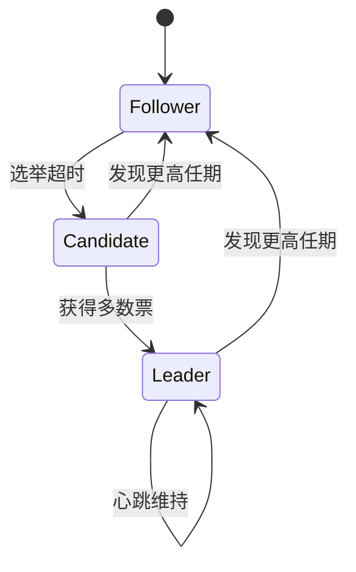

持久化状态（必须先落盘再响应 RPC）：

- `currentTerm`
- `votedFor`
- `log[]`（`{index, term, command}`）

易失状态（所有节点）：

- `commitIndex`
- `lastApplied`

Leader 额外易失状态：

- `nextIndex[]`
- `matchIndex[]`

### 1.3 领导者选举（Leader Election）

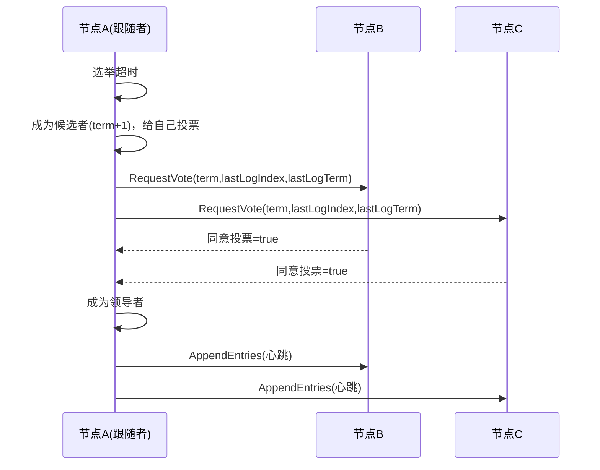

关键规则：

1. 随机化超时（典型 150–300ms）避免 split vote。
2. 每个 term 最多投一票。
3. 候选者日志必须“至少一样新”（先比较 lastLogTerm，再比较 lastLogIndex）。
4. 生产环境建议开启 Pre-Vote，降低网络恢复后的 term 膨胀。

### 1.4 日志复制（Log Replication）

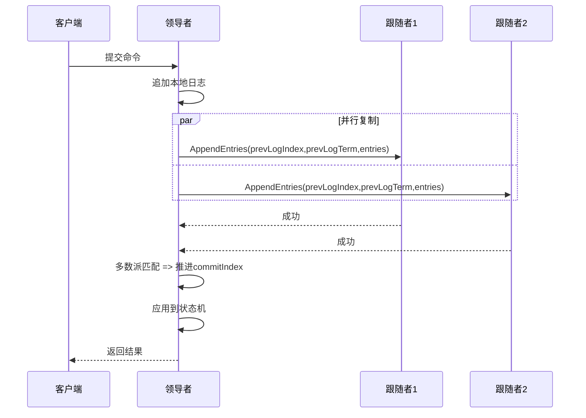

一致性检查：

- Follower 必须在 `prevLogIndex` 位置存在 `prevLogTerm`，否则拒绝并触发 Leader 回退重试。

关键提交约束：

- Leader 只能“直接提交”当前任期日志；旧任期日志通过提交新任期日志间接提交。

### 1.5 五大安全性保证

| 保证                 | 含义                                      |
| -------------------- | ----------------------------------------- |
| Election Safety      | 每个 term 最多一个 Leader                 |
| Leader Append-Only   | Leader 仅追加，不覆盖自身日志             |
| Log Matching         | 同 index+term 的日志，之前前缀必一致      |
| Leader Completeness  | 已提交日志必出现在后续更高 term Leader 中 |
| State Machine Safety | 同 index 不会应用不同命令                 |

### 1.6 快照与日志压缩（Snapshot / Compaction）

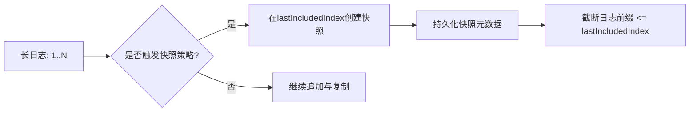

当 Follower 落后太多且 Leader 已丢弃所需日志，使用 `InstallSnapshot` RPC 追赶。

### 1.7 成员变更（Membership Change）

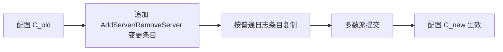

工程建议：优先采用“单节点变更”策略（一次只增/删一个节点）。

---

## 2. 面向 EasilyNET 的工程化架构

### 2.1 目标分层

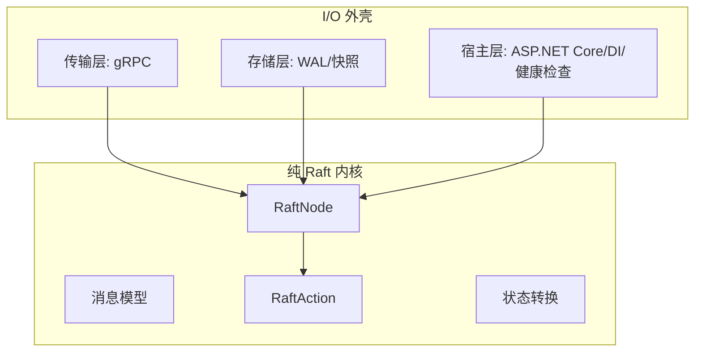

核心约束：

- `RaftNode` 只做状态转换，不直接做网络、磁盘、定时器 I/O。
- 输入：`RaftMessage + CurrentState`。
- 输出：`RaftResult(NewState + Actions[])`。

### 2.2 项目结构（建议）

```text
src/
├── EasilyNET.Raft.Core/
├── EasilyNET.Raft.Transport.Grpc/
├── EasilyNET.Raft.Storage.File/
└── EasilyNET.Raft.AspNetCore/
```

细分建议保持：

- `Core`：消息、状态、引擎、动作模型、抽象接口。
- `Transport.Grpc`：RPC 合同、客户端/服务端适配。
- `Storage.File`：WAL、状态、快照持久化。
- `AspNetCore`：`IHostedService`、DI、健康检查、管理端点。

### 2.3 边界接口（核心抽象）

- `IRaftTransport`：发送 `RequestVote` / `AppendEntries` / `InstallSnapshot`。
- `ILogStore`：追加、范围读取、按索引读取、截断、最后索引任期。
- `IStateStore`：`currentTerm` 与 `votedFor` 的原子保存/加载。
- `ISnapshotStore`：快照写入、读取、元数据管理。
- `IStateMachine`：应用日志、创建快照、快照恢复。

### 2.4 Action 驱动内核（关键设计）

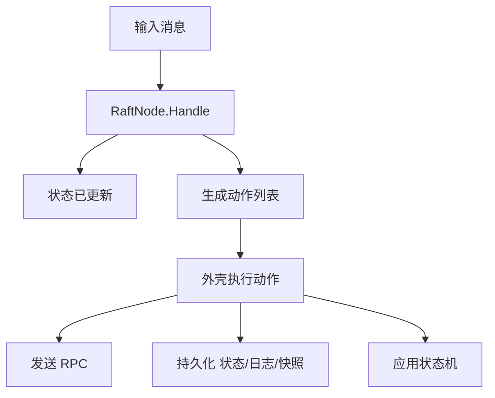

建议动作集合：

- `SendMessage(target, message)`
- `PersistState(term, votedFor)`
- `PersistEntries(entries)`
- `ApplyToStateMachine(entries)`
- `TakeSnapshot(lastIncludedIndex, lastIncludedTerm)`
- `ResetElectionTimer` / `ResetHeartbeatTimer`

---

## 3. 分阶段实现路线（可交付/可验收）

### Phase 1：基础骨架

- 产物：模型、消息、接口、`InMemory` 存储、最小 `RaftNode`。
- 验收：编译通过；基础单元测试（消息处理分支）通过。

### Phase 2：核心算法

- 产物：选举、心跳、日志复制、提交推进、回退重试。
- 验收：三节点确定性模拟可稳定选主并复制提交。

### Phase 3：持久化

- 产物：WAL、状态存储、快照、崩溃恢复。
- 验收：故障重启后 term/log/commit 恢复正确。

### Phase 4：传输层

- 产物：gRPC 传输、连接管理、超时/重试、背压控制。
- 验收：多节点进程内/跨进程联调通过。

### Phase 5：生产优化

- 产物：Pre-Vote、ReadIndex、pipeline/batch 复制、成员变更。
- 验收：高抖动网络下稳定性和吞吐达标。

### Phase 6：ASP.NET Core 集成

- 产物：`AddEasilyRaft()`、`IHostedService`、HealthCheck、管理 API。
- 验收：可在样例服务中部署运行，具备可观测性与基础运维能力。

---

## 4. 测试策略（补全：确定性模拟测试为核心）

Raft 的 correctness 优先级高于性能。测试体系按金字塔分层推进：

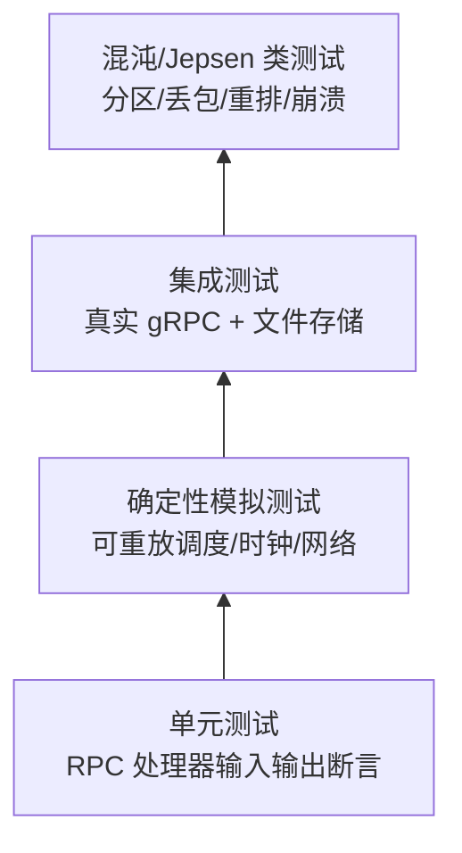

### 4.1 单元测试（底座）

- 覆盖每个 handler：`RequestVote`、`AppendEntries`、`InstallSnapshot`。
- 断言维度：状态变更、动作列表、边界条件、任期回退。
- 每个安全规则对应至少一个反例测试。

### 4.2 确定性模拟测试（核心）

#### 4.2.1 模拟器组件

- `SimClock`：可控逻辑时钟，替代真实时间。
- `SimNetwork`：可配置延迟、丢包、重排、分区。
- `SimScheduler`：离散事件调度器（固定 seed 可复现）。
- `NodeHarness`：包装 `RaftNode` + 虚拟存储 + 输入输出队列。

#### 4.2.2 每轮校验不变量（invariants）

- 同 term 不能出现两个 Leader。
- 已提交日志在所有未来 Leader 上必须存在。
- 已应用状态机索引不能回退。
- 任意节点同索引位不能应用不同命令。

#### 4.2.3 场景库（必须常驻 CI）

1. 正常网络（baseline）。
2. Leader 崩溃并恢复。
3. 少数派分区（孤岛 Candidate 不得破坏集群）。
4. 多次 split vote + 随机超时竞争。
5. 日志冲突回退与覆盖。
6. 快照安装追赶（lagging follower）。
7. 配置变更（单节点增删）与故障交错。

#### 4.2.4 随机测试与回放

- 每次运行记录：`seed`、事件序列、节点输入输出。
- 失败时输出最小复现场景（缩减事件序列）。
- 支持 `--seed` 重放，确保“线上 bug 可离线复盘”。

### 4.3 集成测试（真实组件）

- 真实 gRPC + 文件存储 + 多节点进程内集群。
- 覆盖网络超时、重连、慢节点、批量复制。
- 校验接口层与 Core 行为一致（协议与语义一致性）。

### 4.4 Chaos / Jepsen-like 验证

- 故障注入：分区、单向网络、抖动、时钟漂移、进程 kill。
- 目标：验证线性一致写入与状态机安全。
- 输出：故障窗口内可用性与恢复时间（RTO）指标。

### 4.5 性能与回归基线

- 指标：吞吐（ops/s）、P50/P99 写延迟、恢复时间、复制落后量。
- 维度：节点数、命令大小、批量大小、fsync 策略。
- 每个里程碑冻结基线并对比回归。

---

## 5. 关键工程细节（生产可用性）

### 5.1 持久化与崩溃一致性

WAL 原则：

1. 先写日志并刷盘（按策略），再对外响应成功。
2. `currentTerm/votedFor` 原子更新，避免“重复投票”。
3. 快照与日志截断必须具备恢复一致性（两阶段元数据）。

建议 fsync 策略：

- `Always`：最安全，延迟高。
- `Batch`：按间隔/批量刷盘，吞吐更高。
- `Adaptive`：低负载时 `Always`，高负载转 `Batch`。

### 5.2 复制优化

- 批量 AppendEntries（`MaxEntriesPerAppend`）。
- Pipeline 复制（并发 in-flight）。
- 快速回退（携带冲突 term/index 信息而非逐条减 1）。
- 慢节点降级：超阈值时优先快照安装。

### 5.3 读路径优化

- 强一致读：`ReadIndex` 或 leader lease（需严格时钟/心跳约束）。
- 默认策略：先保证线性一致，再做只读优化开关。

### 5.4 成员变更策略

- 优先单节点变更（一次一台），减少实现复杂度与风险。
- 变更日志提交后才生效。
- 变更窗口内禁用并发变更请求。

---

## 6. 配置模型（`IOptions<RaftOptions>`）与校验

建议配置项：

| 配置                   |   默认值 | 约束                     |
| ---------------------- | -------: | ------------------------ |
| `ElectionTimeoutMinMs` |      150 | `> HeartbeatIntervalMs`  |
| `ElectionTimeoutMaxMs` |      300 | `> ElectionTimeoutMinMs` |
| `HeartbeatIntervalMs`  |       50 | 显著小于选举超时         |
| `MaxEntriesPerAppend`  |      100 | `>= 1`                   |
| `SnapshotThreshold`    |    10000 | `>= MaxEntriesPerAppend` |
| `EnablePreVote`        |     true | 生产建议开启             |
| `NodeId`               | required | 非空且在集群成员中       |
| `ClusterMembers`       | required | 数量 `>= 3`（建议奇数）  |

`ValidateOnStart` 建议：

- 配置不合法时启动即失败，避免运行时隐患。

---

## 7. 可观测性与运维

### 7.1 指标（Metrics）

- 角色与任期：`raft_role`, `raft_term`。
- 复制：`raft_append_latency`, `raft_replication_lag`。
- 提交：`raft_commit_index`, `raft_last_applied`。
- 选举：`raft_election_count`, `raft_leader_changes_total`。
- 快照：`raft_snapshot_create_seconds`, `raft_snapshot_install_seconds`。

### 7.2 日志（Logs）

- 关键事件：选主、降级、提交推进、快照安装、成员变更。
- 必带上下文：`nodeId`, `term`, `leaderId`, `lastLogIndex`, `commitIndex`。

### 7.3 健康检查（Health）

- `Liveness`：节点事件循环正常。
- `Readiness`：可服务（Leader 或可转发到 Leader）。
- 附加：与多数派连接健康度。

### 7.4 Runbook（最小）

1. Leader 抖动：检查超时配置与网络 RTT。
2. 提交停滞：检查多数派连通性与慢节点。
3. 快照频繁：调高阈值或优化状态机快照速度。
4. 启动失败：优先排查配置校验与存储权限。

---

## 8. 开发任务分解（可直接执行）

### 8.1 Core

- 定义消息、状态、动作、`RaftResult`。
- 实现 `RaftNode` 状态机主分发。
- 实现选举路径（含 Pre-Vote）。
- 实现复制与提交推进。

### 8.2 Storage

- `FileLogStore`（WAL append/read/truncate）。
- `FileStateStore`（term/votedFor 原子存取）。
- `FileSnapshotStore`（写入、校验、恢复）。

### 8.3 Transport

- `raft.proto` 设计（兼容扩展字段）。
- `GrpcRaftTransport`（客户端重试与超时）。
- `GrpcRaftService`（服务端适配 Core）。

### 8.4 ASP.NET Core 集成

- `AddEasilyRaft()` 扩展注册。
- `RaftHostedService` 生命周期编排。
- `RaftHealthCheck` + 管理端点（状态查询、成员变更）。

### 8.5 Testing

- 单元测试覆盖核心 handler。
- 确定性模拟器与场景库。
- 集成测试与 Chaos 管线。

---

## 9. 关键 Mermaid 图（开发阶段可直接复用）

### 9.1 选举决策流

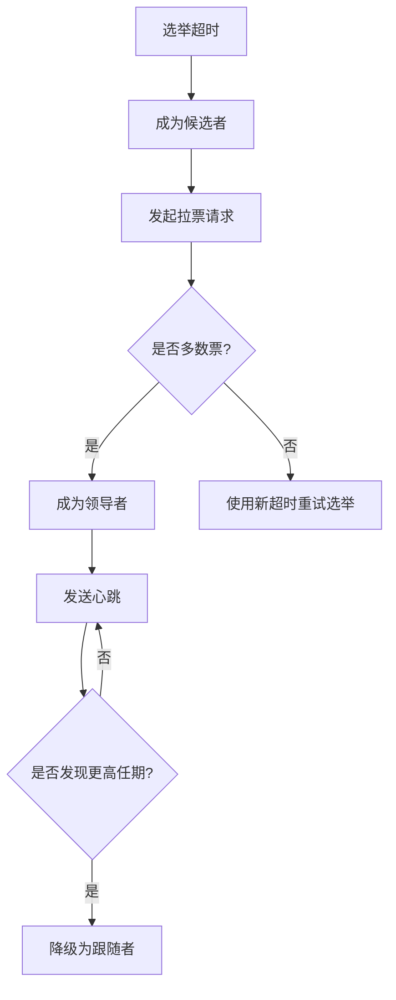

### 9.2 日志一致性回退流

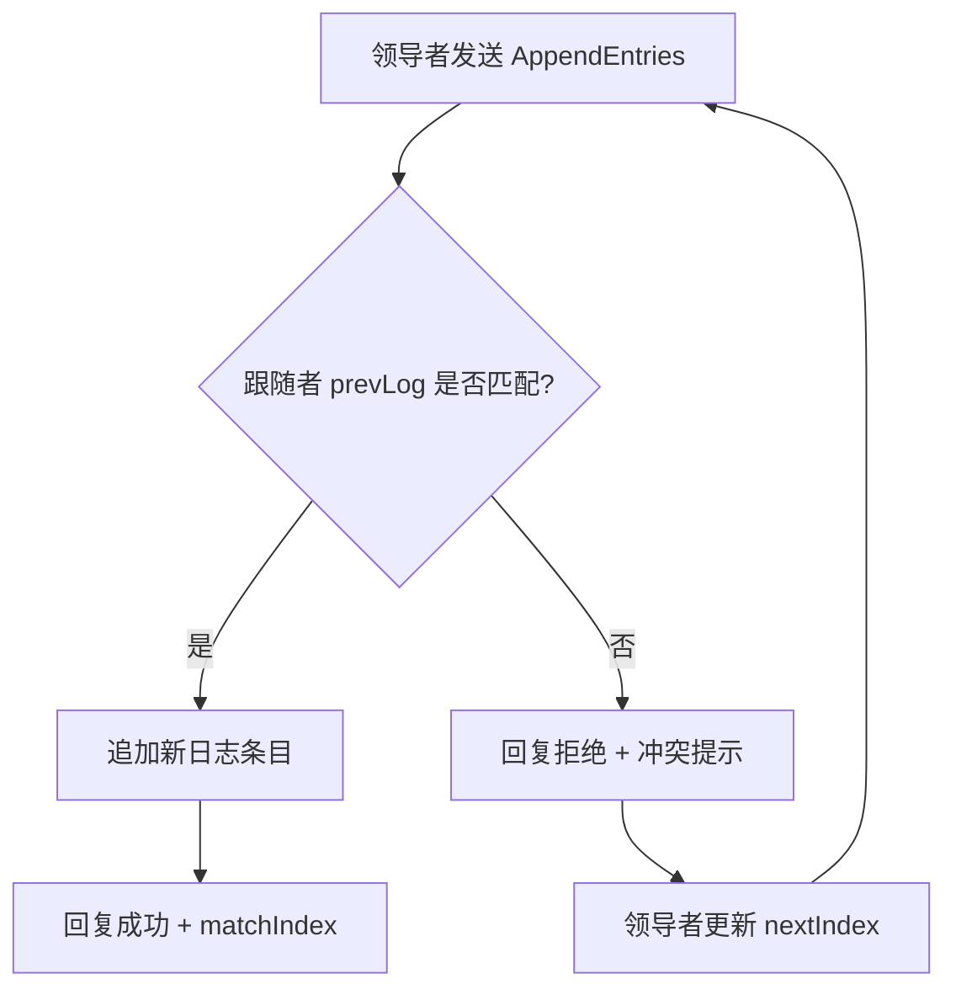

### 9.3 提交推进规则（含任期约束）

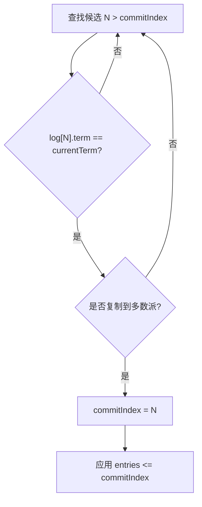

### 9.4 架构依赖方向

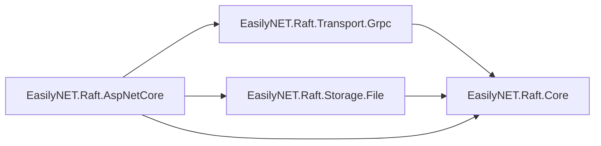

---

## 10. 风险与决策记录（ADR 建议）

建议在实现过程中形成 ADR：

1. 为什么采用“纯内核 + I/O 外壳”。
2. 为什么优先“单节点成员变更”。
3. Pre-Vote/ReadIndex 默认开启策略。
4. WAL fsync 策略与性能权衡。
5. 快照触发策略与阈值依据。

---

## 11. 里程碑验收标准（Definition of Done）

### M1（Core 骨架）

- 所有核心类型稳定。
- 单元测试可验证状态转移。

### M2（算法可用）

- 三节点模拟稳定选主与提交。
- 安全性不变量全通过。

### M3（持久化可恢复）

- 崩溃后恢复一致。
- 快照与日志裁剪协同正确。

### M4（可部署）

- gRPC 联调通过。
- ASP.NET Core 集成可运行、可观测。

### M5（生产准备）

- Chaos 场景通过率达标。
- 性能基线稳定，回归可检测。

---

## 12. 结语

本方案将 Raft 的正确性（Safety）作为第一优先级，以确定性模拟测试作为工程抓手，并采用 EasilyNET 一贯的分层与配置风格。按上述路线推进，可逐步形成“可测试、可演进、可运维”的 Raft 组件体系，为后续分布式能力建设提供稳定基础。
