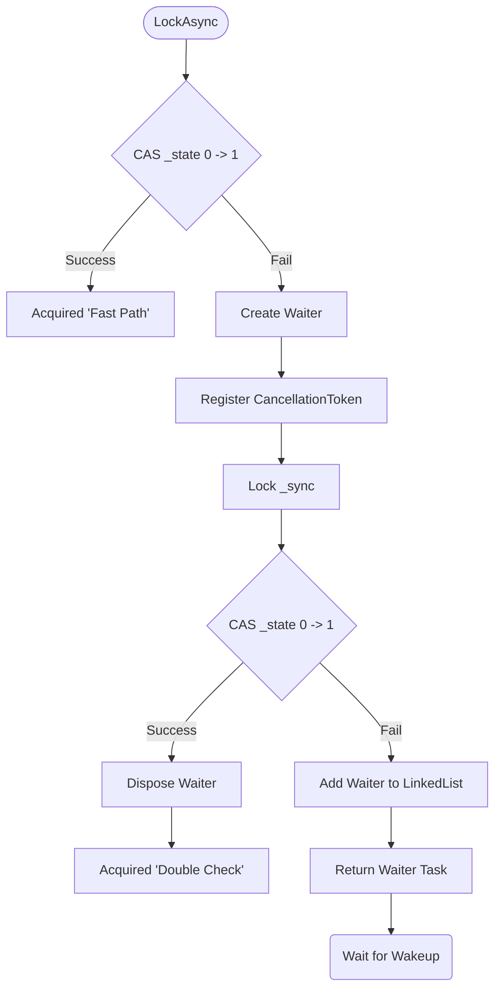
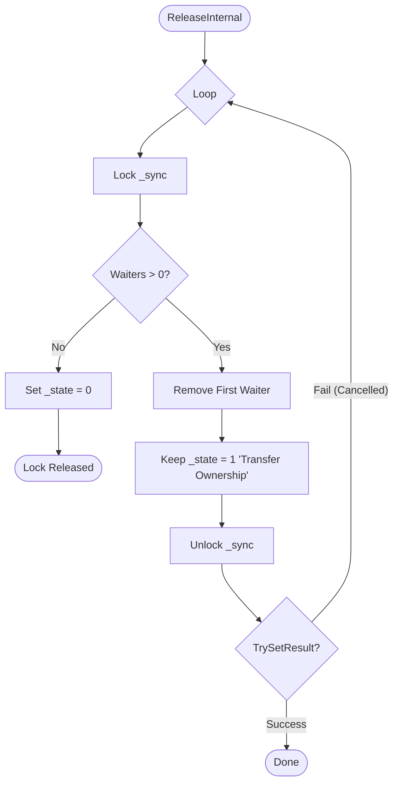

# AsyncLock 深入分析

`AsyncLock` 是 EasilyNET.Core 中用于实现异步互斥的核心原语。它的设计目标是在高并发场景下提供极低的内存分配和高性能，同时保证严格的先进先出（FIFO）顺序。

## 核心设计理念

1.  **快慢路径分离 (Fast/Slow Path)**:
    - 绝大多数无竞争场景下，通过 `Interlocked` 原子操作即可完成锁定，零内存分配（除了 Struct 包装）。
    - 仅在发生竞争时才实例化等待节点（Waiter）。
2.  **所有权移交 (Handoff Semantics)**:
    - 释放锁时，直接将所有权移交给队列中的下一个等待者，而不是将锁重置为“空闲”。
    - **优势**: 防止了“抢占（Barging）”，即新来的请求抢走了刚刚释放的锁，导致排队者饥饿。
3.  **O(1) 取消机制**:
    - 使用 `LinkedList` 存储等待者，支持 $O(1)$ 复杂度的节点移除，这对于支持 `CancellationToken` 至关重要。

## 逻辑流程图

### 1. 获取锁流程 (Acquire Flow)



### 2. 释放锁流程 (Release Flow)



## 关键代码解析

### 1. 状态管理

```csharp
// 0 = 空闲, 1 = 占用
private int _state;

// 快路径尝试
if (Interlocked.CompareExchange(ref _state, 1, 0) == 0)
{
    // 获取成功
}
```

### 2. 等待者结构 (Waiter)

```csharp
private sealed class Waiter
{
    // 使用 RunContinuationsAsynchronously 防止栈溢出
    internal readonly TaskCompletionSource<Release> Tcs = new(TaskCreationOptions.RunContinuationsAsynchronously);
    internal LinkedListNode<Waiter>? Node;

    // ...
}
```

### 3. 取消处理

取消注册使用了 `UnsafeRegister`，避免捕获 `ExecutionContext`，减少开销。

```csharp
waiter.CancellationRegistration = cancellationToken.UnsafeRegister(..., waiter);
```

## 使用场景

虽然 C# 提供了 `SemaphoreSlim(1, 1)` 可以作为异步锁，但 `AsyncLock` 提供了更明确的语义（Disposability 用于释放）和针对性的性能优化。

```csharp
private readonly AsyncLock _mutex = new();

public async Task DoSafeWorkAsync()
{
    // 使用 using 语法糖自动释放
    using (await _mutex.LockAsync())
    {
        await DoSomethingCritical();
    }
}
```
