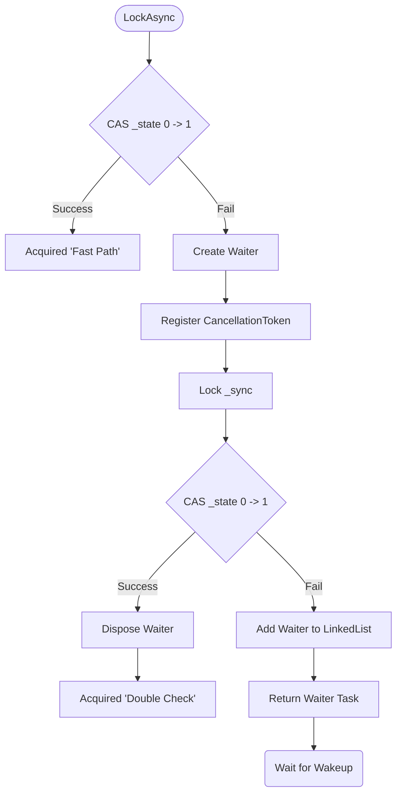
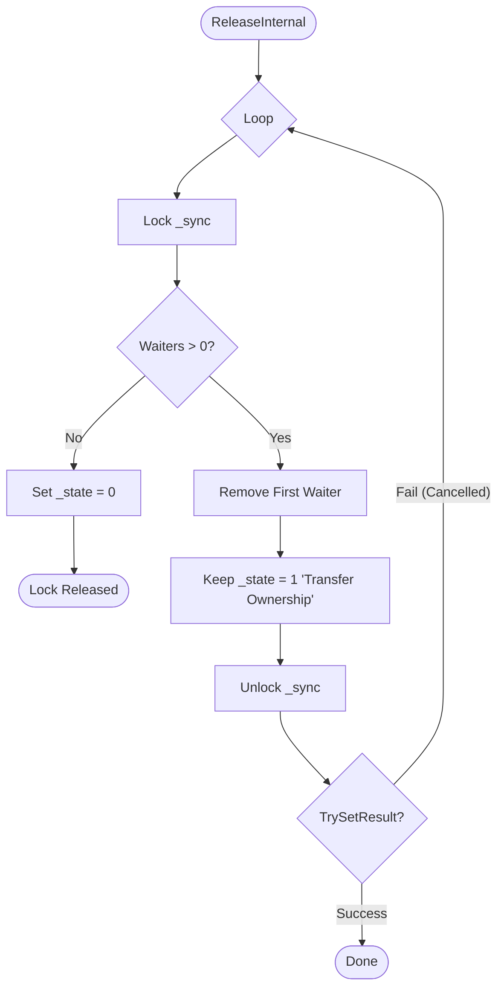

# AsyncLock 深入分析

`AsyncLock` 是 EasilyNET.Core 中用于实现异步互斥的核心原语。它的设计目标是在高并发场景下提供极低的内存分配和高性能，同时保证严格的先进先出（FIFO）顺序。

## 核心设计理念

1. **快慢路径分离 (Fast/Slow Path)**:
    - 绝大多数无竞争场景下，通过 `Interlocked` 原子操作即可完成锁定，零内存分配（除了 Struct 包装）。
    - 仅在发生竞争时才实例化等待节点（Waiter）。
2. **所有权移交 (Handoff Semantics)**:
    - 释放锁时，直接将所有权移交给队列中的下一个等待者，而不是将锁重置为“空闲”。
    - **优势**: 防止了“抢占（Barging）”，即新来的请求抢走了刚刚释放的锁，导致排队者饥饿。
3. **O(1) 取消机制**:
    - 使用 `LinkedList` 存储等待者，支持 $O(1)$ 复杂度的节点移除，这对于支持 `CancellationToken` 至关重要。

## 逻辑流程图

### 1. 获取锁流程 (Acquire Flow)


```mermaid
flowchart TD
    Start([LockAsync]) --> CheckState{CAS _state 0 -> 1}

    %% Fast Path
    CheckState -- Success --> AcquiredFast[Acquired 'Fast Path']

    %% Slow Path
    CheckState -- Fail --> InitWaiter[Create Waiter]
    InitWaiter --> RegCancel[Register CancellationToken]
    RegCancel --> LockSync[Lock _sync]
    LockSync --> DoubleCheck{CAS _state 0 -> 1}

    DoubleCheck -- Success --> CleanWaiter[Dispose Waiter] --> AcquiredSlow[Acquired 'Double Check']

    DoubleCheck -- Fail --> Enqueue[Add Waiter to LinkedList]
    Enqueue --> ReturnTask[Return Waiter Task]

    ReturnTask --> AwaitTask(Wait for Wakeup)
```

### 2. 释放锁流程 (Release Flow)


```mermaid
flowchart TD
    Start([ReleaseInternal]) --> LoopStart{Loop}
    LoopStart --> LockSync[Lock _sync]

    LockSync --> CheckWaiters{Waiters > 0?}

    %% No Waiters - Unlock
    CheckWaiters -- No --> ResetState[Set _state = 0]
    ResetState --> UnlockReturn([Lock Released])

    %% Have Waiters - Handoff
    CheckWaiters -- Yes --> Dequeue[Remove First Waiter]
    Dequeue --> KeepState[Keep _state = 1 'Transfer Ownership']
    KeepState --> UnlockSync[Unlock _sync]

    UnlockSync --> TryWake{TrySetResult?}

    TryWake -- Success --> WakeDone([Done])
    TryWake -- Fail (Cancelled) --> LoopStart
```

## 关键代码解析

### 1. 状态管理

```csharp
// 0 = 空闲, 1 = 占用
private int _state;

// 快路径尝试
if (Interlocked.CompareExchange(ref _state, 1, 0) == 0)
{
    // 获取成功
}
```

### 2. 等待者结构 (Waiter)

```csharp
private sealed class Waiter
{
    // 使用 RunContinuationsAsynchronously 防止栈溢出
    internal readonly TaskCompletionSource<Release> Tcs = new(TaskCreationOptions.RunContinuationsAsynchronously);
    internal LinkedListNode<Waiter>? Node;

    // ...
}
```

### 3. 取消处理

取消注册使用了 `UnsafeRegister`，避免捕获 `ExecutionContext`，减少开销。

```csharp
waiter.CancellationRegistration = cancellationToken.UnsafeRegister(..., waiter);
```

## 📖 使用指南 (User Guide)

`AsyncLock` 旨在替代 Python/C# 中常见的 `SemaphoreSlim(1, 1)` 模式，提供更安全、更易用的 API。

### 1. 基础用法 (Basic Usage)

最常见的模式是使用 `using` 语句块，确保锁在作用域结束时自动释放：

```csharp
private readonly AsyncLock _mutex = new();

public async Task ProcessDataAsync()
{
    // 获取锁
    using (await _mutex.LockAsync())
    {
        // 临界区代码：同一时间只有一个线程能执行此处
        await DoSomethingCriticalAsync();
    }
    // 锁在此处自动释放
}
```

### 2. 带超时控制 (With Timeout)

防止因死锁或长时间等待导致的系统卡死：

```csharp
public async Task ProcessWithTimeoutAsync()
{
    // 尝试在 3 秒内获取锁
    var result = await _mutex.WaitAsync(TimeSpan.FromSeconds(3));

    if (result.Acquired)
    {
        using (result.Releaser) // 务必释放等待结果中的 Releaser
        {
            await DoWorkAsync();
        }
    }
    else
    {
        // 获取锁超时处理逻辑
        Console.WriteLine("获取锁超时！");
    }
}
```

### 3. 支持取消 (Cancellation)

完全支持 `CancellationToken`，适合 Web API 请求处理：

```csharp
public async Task ProcessRequestAsync(CancellationToken token)
{
    try
    {
        // 如果 token 被取消，这里会抛出 OperationCanceledException
        using (await _mutex.LockAsync(token))
        {
            await DoWorkAsync(token);
        }
    }
    catch (OperationCanceledException)
    {
        // 处理取消逻辑
    }
}
```

### 4. 同步上下文中使用 (Synchronous Usage)

虽然推荐在异步代码中使用，但也支持同步尝试获取（非阻塞）：

```csharp
public void TryUpdateData()
{
    // 尝试立即获取锁，不等待
    if (_mutex.TryLock(out var releaser))
    {
        using (releaser)
        {
            // 只有获取到锁才会执行
            UpdateData();
        }
    }
    else
    {
        Console.WriteLine("当前正忙，请稍后再试");
    }
}
```

## ⚠️ 最佳实践与注意事项

1. **非可重入 (Non-Reentrant)**:

    - 与 `Monitor` (`lock`) 不同，`AsyncLock` 是不可重入的。
    - **错误示例**:
      ```csharp
      using (await _mutex.LockAsync())
      {
          using (await _mutex.LockAsync()) // 死锁！永远在等待自己释放
          { ... }
      }
      ```

2. **结构体释放 (struct Dispose)**:

    - `LockAsync` 返回的是一个 `struct Release`，分配在栈上，零 GC 开销。
    - 务必使用 `using` 或 `try-finally` 确保 `Dispose` 被调用，否则锁将永远不会释放。

3. **性能极佳**:
    - 在无竞争情况下，`AsyncLock` 使用 `Interlocked` 操作，性能远超 `SemaphoreSlim`。
    - 在高并发竞争下，基于 FIFO 队列调度，保证公平性，避免线程饥饿。
